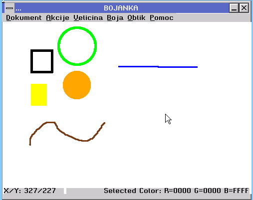

# Bojanka

Jednostavna Paint aplikacija za  **SrBin OS**, inspirisana prvim Windows Paint-om (MS Paint 1.0, 1985).

---

## Funkcionalnosti

### Alati za crtanje
- **Slobodno crtanje** (olovka)
- **Prava linija**
- **Prazan pravougaonik**
- **Pun pravougaonik**
- **Prazan krug**
- **Pun krug**
- **Flood fill** (popuni bojom)

### Debljina četke
- 5 nivoa: **1, 2, 3, 4, 5 px**

### Paleta boja
- 8 osnovnih boja: **crna, bela, crvena, zelena, plava, žuta, narandžasta, braon**

### Fajlovi
- **Sačuvaj** — čuva u `.boj` format (RLE kompresija)
- **Sačuvaj kao** — dijalog za unos imena
- **Otvori** — dijalog za izbor fajla

### Undo / Redo
- **10 koraka** undo/redo
- **RLE kompresija** u memoriji (bez fajlova)
- Brzo i efikasno — tipično **2–10 KB po koraku**

### Ostalo
- Statusna traka sa koordinatama miša i trenutnom bojom
- Meniji: **Dokument, Akcije, Veličina, Boja, Oblik, Pomoć**
- Podrazumevano: **olovka, 2px, crna**

## Format `.boj`

Bojanka koristi sopstveni format za čuvanje slika — **RLE kompresovan** niz piksela:
[header]
width: 4 bajta (uint32_t)
height: 4 bajta (uint32_t)
count: 4 bajta (uint32_t) — broj RLE parova

[body]
pairs: count × 8 bajtova
svaki par: [count: 4B, color: 4B]

**Zašto `.boj`:**
- **Mali fajlovi** — bela pozadina se kompresuje 100x
- **Brzo** — bez konverzije, bez gubitka
- **Isti format** kao undo/redo

---

## Build

Bojanka je deo  **SrBin OS** uspace aplikacija.

Zavisnosti
libui — SrBin OS UI biblioteka (prozori, meniji, dugmići)

libgfx — grafika (bitmap, color, render)

librle — RLE kompresija (custom biblioteka)

libgfximage — TGA dekodiranje (nije trenutno u upotrebi)

## Tehnički detalji
RLE kompresija
Undo/redo koristi Run-Length Encoding — niz parova [count, color]:
typedef struct {
    uint32_t *data;    /* [count, color, count, color, ...] */
    size_t    count;   /* broj parova */
    uint32_t  width;
    uint32_t  height;
} rle_image_t;

## Zašto RLE:

Malo memorije — bela pozadina = 1 par

Brzo — encode/decode su O(n)

Bez fajlova — sve u memoriji (za razliku od starih verzija koje su koristile TGA)

Pitch handling
Helen OS gfx_bitmap_t ima pitch (korak reda) koji može biti veći od width * 4 (padding). RLE encode/decode poštuje pitch:

## Autor
ZmajSoft © 2025–2026

## Zahvalnost
Helen OS tim — za UI i gfx biblioteke

Jiri Svoboda — za uidemo primer

Martin Decky, Stanislav Kozina — za original top aplikaciju (koja je poslužila kao osnova za Bojanku)

Sean Barrett — za stb_image biblioteke (inspiracija za RLE)

## Doprinosi
Pull requests su dobrodošli. Za veće izmene, otvorite issue prvo da razmotrimo.

Ideje za buduće verzije
□ Toolbar sa ikonama
□ Guma (eraser)
□ Text tool
□ Select / Copy / Paste
□ PNG Save/Load (preko stb_image)
□ Zoom
□ Nuklear UI za SrBin OS 2.0
